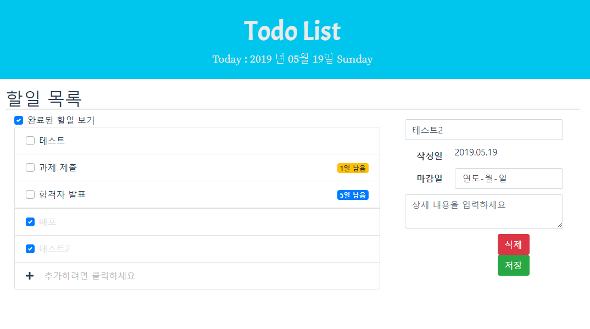

# 2019 Programmers Summer Coding Internship Todo-List Assignment


## 1. 소개
2019 Programmers Summer Coding Internship Todo-List Front-End 입니다.
개발 환경은 Vue.JS + Vue BootStrap 입니다. 
배포는 AWS S3 + CloudFront를 활용하였습니다.

## 2. 설치 및 빌드방법
> Back-End 먼저 설치/실행 후 Front-End를 설치/실행하시는 것을 권장드립니다.
### 1. 설치    
```
cd frontend && npm install
```  

### 2. 실행  
```npm run serve```  
이후 http://localhost:9000 를 통해 서비스를 이용할 수 있습니다.

### 3. 빌드  
```npm run build```   
> /dist 폴더에 빌드된 결과물들이 생깁니다.